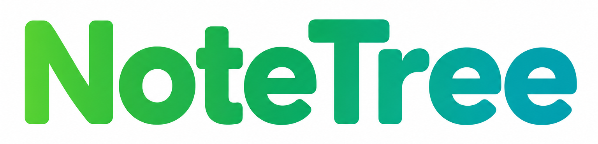

# NoteTree · Grow a knowledge tree as you learn

An ultra-lightweight learning scratchpad that links new knowledge to what you
already know — the moment you learn something new, hang it onto your existing
knowledge with the smallest possible gesture. Select an old topic, hit
**+ Child card**, type the new one; double-click to rename, click a card to jot
a short summary. The tree grows with your learning, one node at a time.

The tree is a **map of links** between old and new knowledge, not a note
archive: every card is deliberately tiny — a title and a few lines. Systematic
notes belong in your real notebook; this tool only makes sure "what I just
learned" and "what I already know" get connected on the spot. It is
subject-agnostic and not tied to any exam board; start from an empty tree and
grow it as you go.

The whole tool is **a single ~120 KB HTML file**: no installation, no account,
**double-click and it opens instantly** — no loading screen, no pop-ups. To
move devices, just send the file to yourself; open it on a phone or iPad and
the full tree is there. Works offline; makes no network requests by default.
Nodes can be collapsed (fold away what you don't need right now), edited,
deleted, and picked into a basket for export. The UI switches between English
and Chinese with one click.

**The tool is open source (MIT); the trees you generate are your private
files.** In its default form this tool sends and receives no data — everything
stays on your device. (If you enable the optional AI mounting described below,
see that section for the exact data flow.)

## Quick start

**There is no install step.** Put `NoteTree.html` in any folder you like,
**double-click it**, and start:

1. **Lay a base.** Skim your old notes (say, the notebook from the IG→AS or
   AS→A2 transition) and hang the topics that left an impression: select a
   node → **+ Child card** → type a name. It doesn't need to be complete —
   you'll fill it in as you learn.
2. **Daily use.** Learned something new? Select the old topic it belongs to
   and add a child card. Double-click a title to rename, drag a node to
   re-mount it elsewhere, click a card to write a short summary, Ctrl+Z to
   undo. A few dozen seconds a day.
3. **Save and carry.** Click **Save new version** — the browser downloads a
   new file, which is now your latest version; the old file is naturally your
   backup. The exported HTML runs on every platform (see below). Every saved
   tree carries your notes and **is strictly your private file — do not send
   it to anyone**. If a classmate wants the tool, send them the original empty
   `NoteTree.html` and let them grow their own tree.

Want to see what a grown tree looks like? Open the sample tree in `sample/`.
When you receive a newer `NoteTree.html` (feature update): open the new
version → **Import / Export** → import your old tree file — migration done.

## Platform support

| Device | How |
|---|---|
| **Windows / macOS** | Double-click `NoteTree.html` (or any tree file you saved) |
| **iPad / iPhone** | Opening the tree file directly inside a chat app shows a **static white preview** — iOS file previews never run web scripts, and Safari won't open local web files; that's system behaviour, the file is fine. **Do this instead:** install the free *Documents by Readdle*; when you receive a tree file, use the share sheet → "Save to Documents"; from then on you open, edit, save, and share from that one app. Touch: one-finger pan, two-finger pinch zoom, long-press a node to drag-remount, double-tap a title to rename in place. GoodNotes / Notability treat it as a dead document — don't open it with those. |
| **Android phone / tablet** | Send the tree HTML to the device and open it from Files with **Chrome / Edge**. Touch gestures are the same as iPad. |

It's the same file with the same features on phone and tablet; migrate between
versions with **Import / Export**.

## Rules of use

### Your tree files

1. Trees you generate are **your private study files**: do not upload them to
   public or semi-public channels (public cloud links, group chats, forums,
   social media). Want to show someone the idea? Let them grow their own tree.
2. **Write summaries and every editable field in your own words; pasting mark
   schemes, exam papers, or textbook text verbatim is prohibited.** (The tool
   pops a reminder on suspicious pastes, but the responsibility is yours.)
3. Do not compile tree content into question banks or hand-out material for
   distribution, or label/imply it as authentic exam or official content.
4. Basket-exported `.txt` files and **Export JSON** data files are bound by
   the same rules as the main file.
5. Risk note: using any electronic tool (including this one) in an ongoing
   exam, controlled assessment, or any setting that forbids electronic tools
   is an exam-conduct violation.

### Disclaimers

6. This is a personal open-source project provided "as is", with no promise of
   support; it is not affiliated with or endorsed by any exam board or course
   platform (names like IGCSE/CAIE are mentioned only to indicate applicable
   contexts).
7. To the extent permitted by law, users are responsible for what they input
   and for every use of the output files; copyright or exam-conduct
   consequences of violating the rules above rest with the user.
8. Complained-of material in distributions controlled by the maintainer will
   be removed or corrected after reasonable verification (feedback &
   complaints: **LearningNoteTree@protonmail.com**, or via whichever channel
   you got this file from); the maintainer cannot control code already copied
   by others or users' local files.

## Built-in protections

- **Local-only by default**: no network requests, no data sent; tree files and
  exports live solely on your device.
- **Paste reminders**: edit boxes warn on pastes that look like official
  material or mark-scheme wording (a reminder, not a guarantee — not pasting
  official material is always the user's responsibility).
- **Burned-in footer notice**: generated HTML and basket exports carry a
  "private file · do not distribute" notice, and are labelled for AI content
  when applicable.
- **Backups exist by construction**: **Save new version** always writes a new
  file, so the previous file is your backup.

## AI mounting (optional, off by default)

This is an optional feature, **disabled by default**, which only runs if you
already hold an API key for the Kimi (Moonshot) open platform or the Zhipu GLM
open platform. **Users under 18:** all account matters — whether to sign up,
registration, and costs — belong to your guardian to decide and operate. This
project does not provide keys, does not register accounts for you or walk you
through it, and does not recommend that anyone open an account or top up for
this feature. Platform-side registration, fees, and account matters are the
responsibility of the user (or their guardian); use is governed by the
[Kimi model-use agreement](https://login.moonshot.cn/user/argeement/modeluse)
and the platform's other applicable terms (link per the official live page,
reachable as of 2026-09; "argeement" is the official page's original
spelling), or by the Zhipu open platform's corresponding terms if you choose
GLM. Having no key does not affect any other feature.

The feature itself: once enabled, an **AI mount** button appears in the top
bar — you type one sentence describing a concept; the AI identifies it,
proposes cards and a mounting position; nothing touches the tree until you
preview, correct, and approve. Saving can also ask the AI to suggest a file
name.

- **How to enable**: open **About / Notice**, tick "Enable AI mounting"
  (the switch is saved with the tree file); first use shows a one-time
  informed-consent dialog.
- **Providers & configuration**: two providers are supported, pick one — Kimi
  (Moonshot, default) or Zhipu GLM; models are the kimi-k3 and glm-5.3
  series. Custom endpoints are not supported; keys from any other platform
  will not work. Configuration happens in the browser console — see
  **About / Notice → Configuration** inside the tool (the key is stored only
  in your local browser, never in the tree file).
- **Data flow**: when enabled, what is sent to the Kimi open platform
  (Moonshot AI) is: the sentence you typed in the mount box, the tree name,
  the selected node's title and id, and a directory of node titles across the
  tree (up to 400, so the AI can choose a position); "AI-named save" sends
  the tree name and the titles of a few recent cards. Card summary bodies and
  your file itself are never sent. Requests go **directly from your browser**
  to api.moonshot.cn; this project has no server, no relay, no retention, and
  cannot see any request. The underlying model and API service are provided
  by Moonshot; this project is only a local client UI (regulatory role
  classification per the applicable regulator's interpretation; data
  retention and training use per that platform's policy). Tree names and node
  titles travel with requests — **do not put real names, school names, or any
  personal information in them, let alone sensitive personal information
  about yourself or others.**
- **Input prohibitions (read before enabling)**: never input any content from
  exam materials that have not been officially released (an exam-conduct red
  line — consequences can reach your grades); do not input the text or
  fragments of official exam materials (papers, mark schemes, syllabus text,
  examiner reports, inserts, listening scripts) — violations may cause the AI
  feature to stop working; do not input excerpts from textbooks, study guides,
  or other people's notes. Material restricted by platform terms, school
  policy, or confidentiality — even if you may read it — is not yours to
  submit to a third-party AI: once sent, it reaches a third-party platform,
  so check before sending. For assessed work that requires declaring AI use
  (e.g. coursework), declare per your school's and exam board's rules.
- **AI output rules**: AI-generated cards carry a source label in the UI, in
  copies, and in exports, kept distinct from what you wrote. If an AI output
  turns out to closely match official material, delete the card or
  regenerate — do not keep it. Commercial use or external distribution of AI
  output is prohibited. AI content can be wrong; its origin and rights status
  are not independently verified and it is a study hint only; its use is
  subject to applicable law and the model provider's terms, and this project
  makes no claim that AI output is exclusive or free of third-party rights.
- **Key storage**: the key lives only in your local browser and never enters
  saved tree files. The optional "cross-device carry" writes a
  passphrase-encrypted ciphertext (PBKDF2 + AES-GCM) into the tree file; the
  passphrase (10+ characters) is the only line of defence and cannot be
  recovered — remove the carry blob whenever you don't need it. **The key is
  your private property; give it to no one.** Browsers share one local
  storage across all local pages — after configuring a key, do not open
  untrusted local HTML files in the same browser; prefer a key with a
  spending cap that you can revoke at any time.
- The bulk-import channel (building a tree directly from whole
  notes/documents) has been **permanently removed**.

## License

Three layers of rights — don't conflate them:

- **The tool code and the tree shell**: MIT (see `LICENSE`) — free to copy,
  modify, and redistribute, including commercially; none of the
  "do not distribute" language above applies to the shell code itself.
- **The note content you write into trees**: you hold the rights to your own
  original expression; third-party material you import or quote stays with
  its owners. The "do not distribute" rules target this private note content.
- **AI-generated content** (if enabled): its copyrightability and rights
  status are not guaranteed — see the AI mounting section.

Generated tree files are controlled and stored locally by you.

## What was sanitized before publishing (read this before filing a bug)

- The distributed `NoteTree.html` and `sample/sample-tree.html` are
  **deliberately clean public builds**: no one's real notes, no API keys, and
  the sample tree contains only generic textbook-level demo content. The AI
  feature ships disabled with its entry hidden; while disabled the tool makes
  **zero network requests**.
- Tree files you save yourself (`xxx_vN_date.html`) embed your real notes
  (and, if you ever enabled cross-device carry, an encrypted key blob) —
  **never publish those**; the only shareable files are the two in this
  repository.
- The bulk-import channel was **permanently removed** — that's not a bug.
- AI mounting requires your own key configured via the browser console (a
  deliberate speed bump); the absence of a graphical key-entry box is not a
  bug either.

## Contact

If the tool doesn't work for you, or you have **any** concern about this
project (rights, content, privacy — anything at all), contact me right away:
**LearningNoteTree@protonmail.com**. I will respond and fix it.
